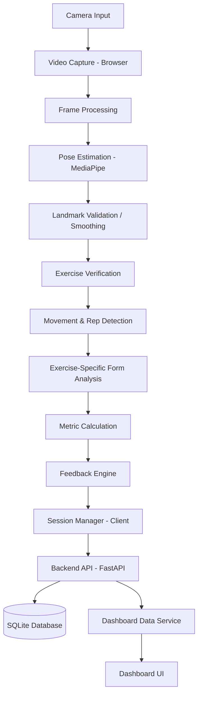
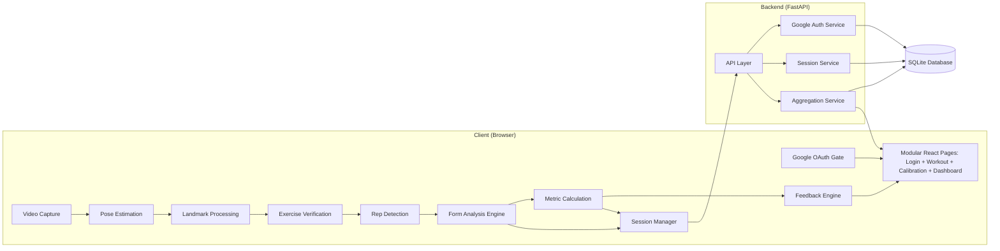
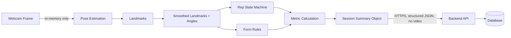
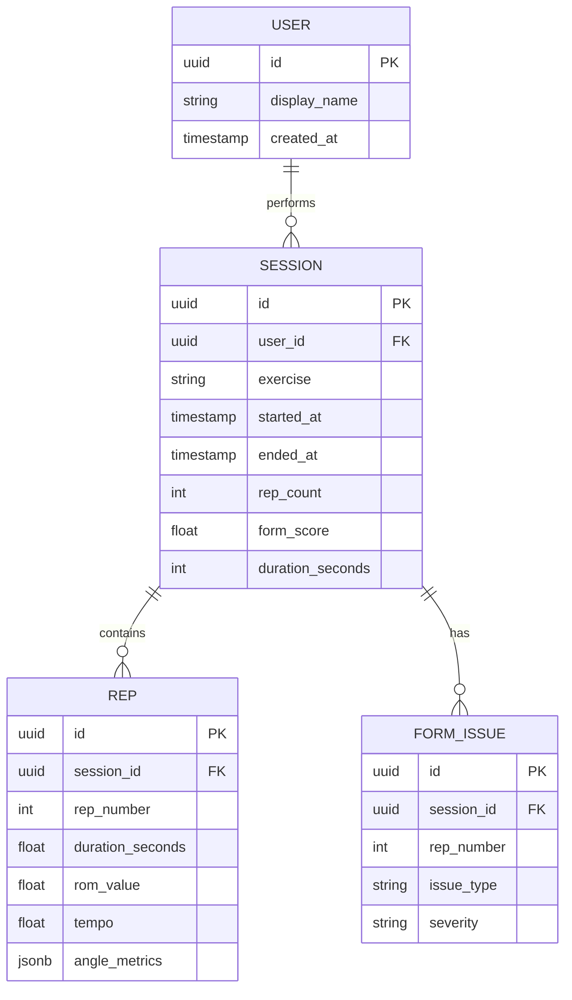
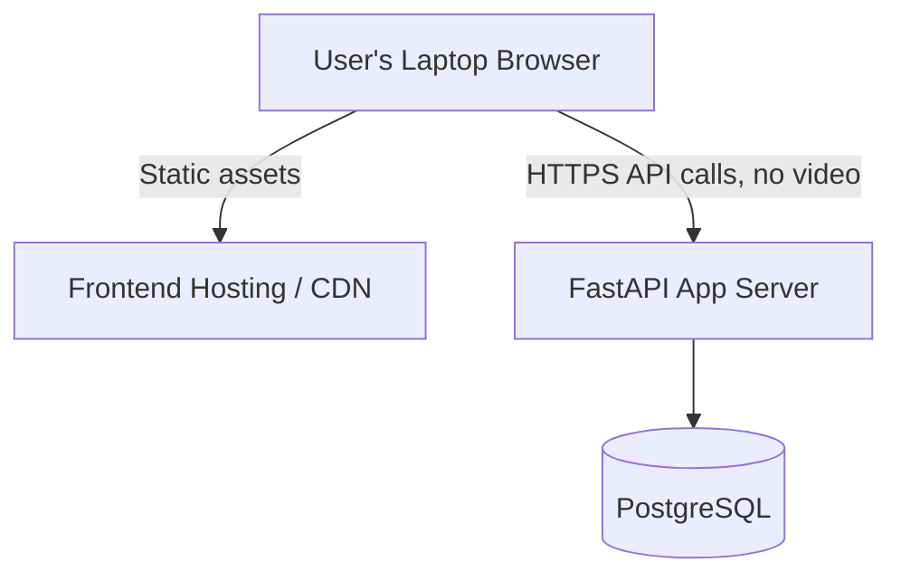

# System Architecture Document

## 1. Architecture Overview

V1 is a client-server web application. The browser captures webcam video and runs real-time pose estimation, calibration, and rep/form logic locally for responsiveness; the backend handles accounts, session persistence, dashboard aggregation, and optional AI coaching. No video is transmitted to or stored on the backend — only structured, derived session data and calibration values. The AI coaching layer uses retrieval-augmented generation to explain measured results using approved guidance.

## 2. Architecture Goals

* Real-time responsiveness for feedback during a set.
* Clear separation of concerns: pose estimation, rep detection, form analysis, feedback, and persistence are distinct, swappable components.
* Modularity: pose-estimation and exercise-rule modules can be replaced/extended without rewriting the pipeline.
* Privacy by design: video never leaves transient in-memory/browser processing.
* Realistic V1 scope: no dependency on a large proprietary dataset or heavy server-side ML infrastructure.
* Provide explainable, personalized coaching without allowing an LLM to replace deterministic biomechanics calculations.

## 3. Technology Stack

A single primary stack is selected for V1 (alternatives discussed in Section 30):

| Layer | Technology | Why |
|---|---|---|
| Frontend | React + Vite (Vanilla CSS) | Component model fits real-time UI (HUD overlays, feedback, dashboard); fast bundling; pairs with client-side CV via WebAssembly. |
| Auth & Security | Google OAuth Gateway | Ensures authenticated access to workout views, per-user session isolation, and secure JWT bearer token issuance. |
| Camera/Pose (client) | MediaPipe Pose (Tasks Vision API) + webcam via `getUserMedia` | Runs client-side on CPU/Wasm, avoids streaming video off-device, keeps analysis real-time and privacy-preserving. |
| Movement/Rep/Form logic | JavaScript client pipeline (`AnalysisPipeline`, `SquatStateMachine`, `FormRuleEngine`) | Real-time path runs at full camera FPS; server-side recomputation in Python provides an auditable validation check. |
| Backend | Python + FastAPI | Lightweight, async-friendly, strict Pydantic schemas, and interactive OpenAPI documentation. |
| Database | SQLite (file-backed `app.db` / in-memory for tests) | Zero-configuration relational database ideal for fast local execution and clean testing; PostgreSQL dialect compatible. |
| UI & Layout | Modular Pages + Bespoke SVG Icons | Dedicated single-purpose page components (`LoginPage`, `WorkoutPage`, `CalibrationPage`, `DashboardPage`) and responsive navigation. |
| AI Coaching | Retrieval-augmented LLM service | Converts structured form results and personalized calibration data into conservative coaching explanations grounded in approved guidance. |

## 4. High-Level Architecture

## 5. Component Architecture

## 6. Frontend Architecture

The frontend follows a clean, modular single-page architecture:
- **`LoginPage.jsx`**: Unauthenticated entry gateway; enforces Google OAuth authentication before accessing application capabilities.
- **`WorkoutPage.jsx`**: Dedicated live squat camera view with viewfinder guidelines, active rep counters, real-time HUD overlays, and post-set session summary review modal.
- **`CalibrationPage.jsx`**: 3-step personal biomechanics calibration wizard with live camera MediaPipe tracking to measure limb proportions (femur/torso, shin/torso) and natural range-of-motion.
- **`DashboardPage.jsx`**: Athlete analytics view displaying historical session trends, average and best form scores, and technique flaw breakdowns directly from the SQLite database.
- **Layout (`Navbar.jsx`, `Footer.jsx`)**: Shared responsive navigation with live athlete status and persistent medical disclaimer.
- Real-time CV logic (`PoseEstimator`, `LandmarkSmoother`, `SquatStateMachine`, `FormRuleEngine`, `FeedbackSelector`) runs client-side in browser animation frames. The frontend contacts the backend only for authentication, session submission, calibration baselines, and dashboard reads — never for raw frame processing.
- The coaching service receives structured session summaries, detected issue codes, and personalized calibration values. It retrieves approved guidance before asking the LLM to generate a schema-validated explanation and next-session goal. Raw video is never sent to the retrieval or LLM service.

## 7. Camera/Video Layer

Uses the browser `getUserMedia` API to access the webcam. Frames are read at a practical rate for pose estimation (e.g., configurable, not guaranteed to be a specific fixed FPS — dependent on device performance). No frame is written to disk or sent to the server; frames exist only in browser memory for the duration of processing.

## 8. Pose Estimation Layer

Wraps MediaPipe Pose (BlazePose-based) behind a small internal interface (e.g., `PoseEstimator.detect(frame) -> landmarks[]`) so the underlying model could later be swapped for another lightweight pose model (e.g., MoveNet, YOLO-Pose) without changing downstream components. Outputs 33 landmarks per frame, each with `(x, y, z, visibility)`.

## 8.1 Personalized Calibration

The calibration engine measures femur-to-torso and shin-to-torso ratios, standing and bottom knee/hip angles, and typical torso lean from multiple high-confidence frames. These measurements form an athlete profile and personalize range-of-motion and form thresholds. Joint angles remain geometric calculations from landmark vectors; the LLM is not used for measurement. Robust medians, confidence filtering, and gradual updates are preferred over single-frame or abrupt threshold changes.

## 9. Landmark Processing Layer

Applies temporal smoothing/filtering (e.g., a moving average or a simple low-pass filter over recent frames) to reduce jitter, and computes the joint angles required by the currently selected exercise's rule set. Frames with landmark visibility below a configurable confidence threshold are flagged as low-confidence rather than used directly.

## 10. Exercise Detection (Verification) Layer

Checks that the pattern of motion over a short rolling window is broadly consistent with the selected exercise (e.g., dominant hip/knee motion vs. dominant elbow/shoulder motion) before allowing rep counting to proceed. This is a rule-based sanity check, not a separate trained classifier, keeping V1 dependency-light.

## 11. Rep Detection Layer

Implements a configurable per-exercise state machine (states, angle/position thresholds, hysteresis bands, minimum state durations) as described in `WORKFLOW.md` Section 9. One full state cycle increments the rep count. Configuration is data (e.g., a JSON/config object per exercise), not hard-coded logic, so thresholds can be tuned or later personalized.

## 12. Form Analysis Engine

Evaluates each completed rep's angle/position time series against the selected exercise's rule set (e.g., squat knee-alignment rule, deadlift back-angle rule, bench elbow-flare rule). Produces a list of violations, each with a severity/priority, decoupled from both rep detection (which only decides rep boundaries) and metric calculation (which only computes numbers).

## 13. Feedback Engine

Takes the current frame/rep's violation list (if any) plus visibility status, selects the single highest-priority item, maps it to a pre-authored, specific feedback string, and pushes it to the UI overlay. Debounces messages so feedback doesn't flicker between rules on borderline frames.

## 14. Metrics Engine

Computes per-rep metrics (duration, tempo, ROM, peak/at-bottom angles) and, at session end, aggregates them into session-level statistics (averages, consistency measures, violation counts) and the form score (Section 8 below).

## 15. Backend / API

FastAPI service exposing endpoints for authentication/session identity, submitting a completed session's structured summary, and querying session history/aggregates for the dashboard. See Section 21 for indicative endpoints.

## 16. Database

PostgreSQL, storing users, sessions, per-session metrics, and detected-issue records. See Section 22 for schema.

## 17. Dashboard

Server-side aggregation service computes cross-session trends (ROM over time, consistency, most common issues per exercise, best/average form score) which the React dashboard renders as session lists and simple charts.

## 18. Data Flow

## 19. Real-Time Processing

Everything from Video Capture through the Feedback Engine (Sections 7–13) runs client-side, in real time, on the browser's CPU, to keep latency low and to avoid streaming video off-device. This is the practical V1 choice: browser-side MediaPipe is designed for real-time use on laptops/desktops, and a server round-trip per frame would add latency and bandwidth cost with no accuracy benefit for this use case.

## 20. Session Processing

After a session ends, aggregation (Section 14/17) happens once, using the full in-memory rep/metric history collected during the session; this can run client-side and be sent as a finished summary, or be recomputed/validated server-side from the submitted per-rep metrics for consistency — V1 uses client-side computation with server-side validation of ranges/completeness before persistence.

## 21. API Design

Indicative REST endpoints (FastAPI, JSON):

| Method | Path | Purpose |
|---|---|---|
| POST | `/api/auth/login` | Authenticate user |
| POST | `/api/sessions` | Submit a completed session's structured summary |
| GET | `/api/sessions` | List a user's past sessions (paginated, filterable by exercise) |
| GET | `/api/sessions/{id}` | Get one session's detail (metrics, issues, score) |
| GET | `/api/dashboard/summary` | Aggregate stats: totals, averages, trends, common issues |
| POST | `/api/coaching/analyze` | Retrieve approved coaching guidance and generate a schema-validated LLM explanation from structured session data |

No endpoint accepts video/image upload in V1.

## 22. Database Schema

No table stores video or image data.

## 23. Security

Standard practices for V1 scope: authenticated API access (token-based), HTTPS in any deployed environment, server-side validation of submitted session payloads (range checks, required fields) before persistence, and no execution of user-supplied code.

## 24. Privacy

Video frames are processed only in transient browser memory and are never uploaded, written to disk, or logged. Only the structured fields in Section 22 are persisted. This is consistent with `PRD.md` Sections 16–17.

## 25. Error Handling

Client-side: camera permission/availability errors, low-confidence/occlusion warnings, exercise-mismatch warnings — all surfaced through the Feedback Engine per `WORKFLOW.md` Section 18. Server-side: validation errors on session submission return descriptive 4xx responses; database/backend unavailability is surfaced to the client with a retry option, and the client may hold a completed session summary in local memory/storage briefly to allow retry rather than losing it immediately.

## 26. Scalability

V1's real-time load is inherently distributed across clients (each user's browser does its own pose estimation), so the backend only needs to scale for session-submission and dashboard-read traffic, which is comparatively light. FastAPI + PostgreSQL comfortably handles this at a college-project or small-user-base scale; horizontal scaling of the API layer and read replicas for PostgreSQL are standard future options if usage grows.

## 27. Extensibility

New exercises are added by supplying a new configuration (states, thresholds, rule set) rather than new pipeline code, because Sections 10–14 consume exercise config as data. Swapping the pose model only requires reimplementing the `PoseEstimator` interface (Section 8). Adding new sports is a longer-term extension of the same pattern but is future scope, not implied by V1's architecture alone.

## 28. Deployment Architecture

V1 targets a straightforward deployment: static frontend hosting plus a single backend app server and a managed/self-hosted PostgreSQL instance. No GPU or video-streaming infrastructure is required since pose estimation runs client-side.

## 29. Dataset/ML Architecture

V1 does not include a training pipeline; the Form Analysis Engine is rule-based. The architecture reserves a clear extension point (Section 12/27) where a future learned classifier could be inserted alongside or instead of the rule engine, consuming the same landmark/angle features, if expert-labelled data becomes available (see `PRD.md` Section 18 for candidate public datasets and their limitations).

## 30. Technology Alternatives

* **Server-side pose estimation** (sending frames to a Python/OpenCV+MediaPipe backend) was considered but rejected for V1 due to added latency, bandwidth cost, and privacy exposure of streaming video off-device, with no clear accuracy benefit.
* **Node.js backend** was considered instead of FastAPI; Python was preferred for consistency with MediaPipe's Python ecosystem, NumPy-based metric processing, and easier future ML work.
* **MongoDB** was considered instead of PostgreSQL; PostgreSQL was preferred for the naturally relational session/rep/issue structure and stronger consistency guarantees.

## 31. Architecture Limitations

* Client-side processing performance varies by device; low-end laptops may see reduced frame rate.
* A single camera view limits the accuracy of depth-dependent metrics (see `PRD.md` Section 22).
* Client-computed session summaries rely on server-side validation rather than full server-side recomputation from raw frames (since raw frames aren't sent), which is a deliberate privacy/latency trade-off, not an oversight.

## 32. Future Architecture

Mobile client (React Native or native, same modular pipeline); multi-camera fusion; server-side or edge ML inference for a learned form classifier; offline-first client with sync; coach/athlete multi-tenant data model.
