# Workflow Document

## 1. Overview

This document describes how a user and the system flow through a session, from onboarding to post-session review, for V1's three supported exercises (Squat, Deadlift, Bench Press). It complements `PRD.md` (what/why) and `ARCHITECTURE.md` (technical structure) and must remain consistent with both — same three exercises, same "no video stored" policy, same MediaPipe-based pose pipeline.

## 2. High-Level Workflow

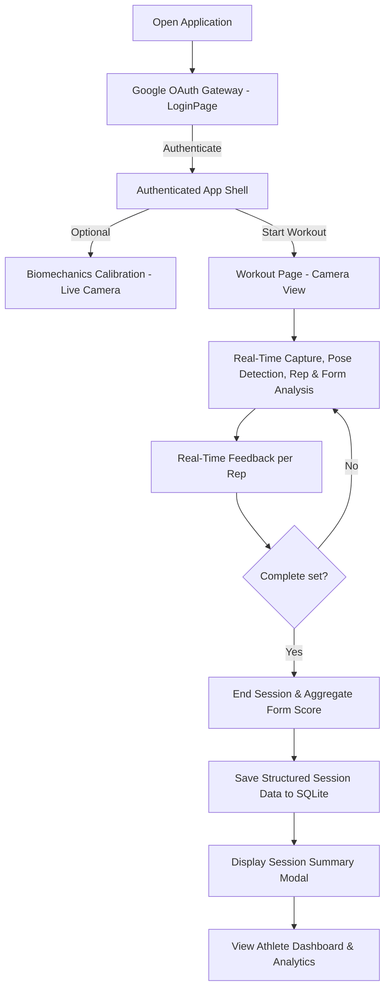

## 3. User Journey

1. **Google OAuth Gate:** User lands on `LoginPage.jsx` and signs in with their Google account email.
2. **Personal Calibration (Optional but Recommended):** User navigates to `CalibrationPage.jsx`, where live MediaPipe camera tracking captures standing and deep squat inflection to calculate personalized femur/torso and shin/torso ratios.
3. **Live Workout:** User navigates to `WorkoutPage.jsx`, positions themselves 6–8 feet from the webcam, and clicks "Start Set".
4. **Real-Time Kinematics:** The system tracks joint angles live on-device, counts deep squat reps, and displays single debounced feedback cues directly on the video HUD.
5. **Session Completion:** User clicks "End Set". A structured summary modal displays rep count, duration, form score, and flagged issues, and saves the session to SQLite via `POST /api/sessions`.
6. **Dashboard Review:** User views historical progress, average form score, personal bests, and priority flaw breakdowns on `DashboardPage.jsx`.

## 4. Camera Initialization Workflow

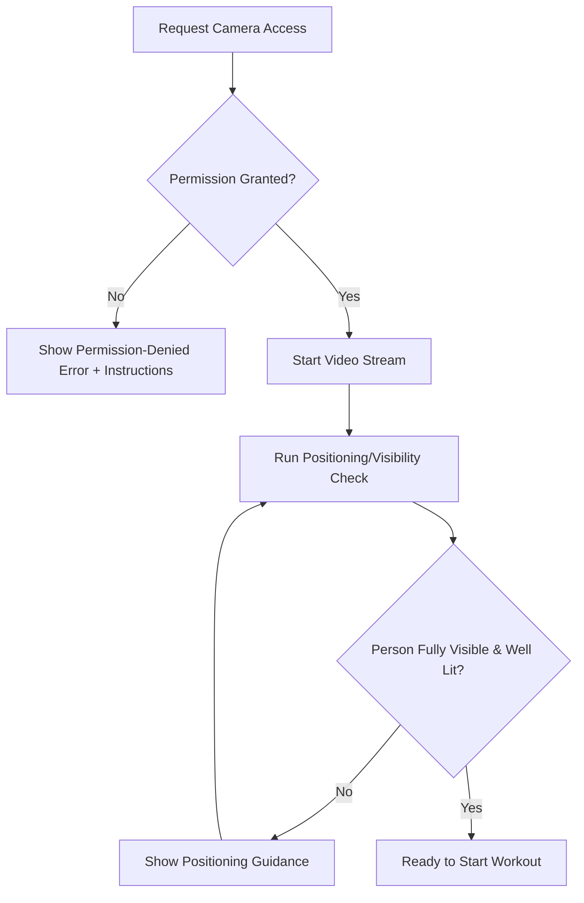

Positioning guidance is exercise-specific (see Section 10–12): e.g., Squat/Deadlift benefit from a side-on view capturing full body and floor; Bench Press benefits from a front/side angle capturing the bar path and elbows.

## 5. Exercise Selection Workflow

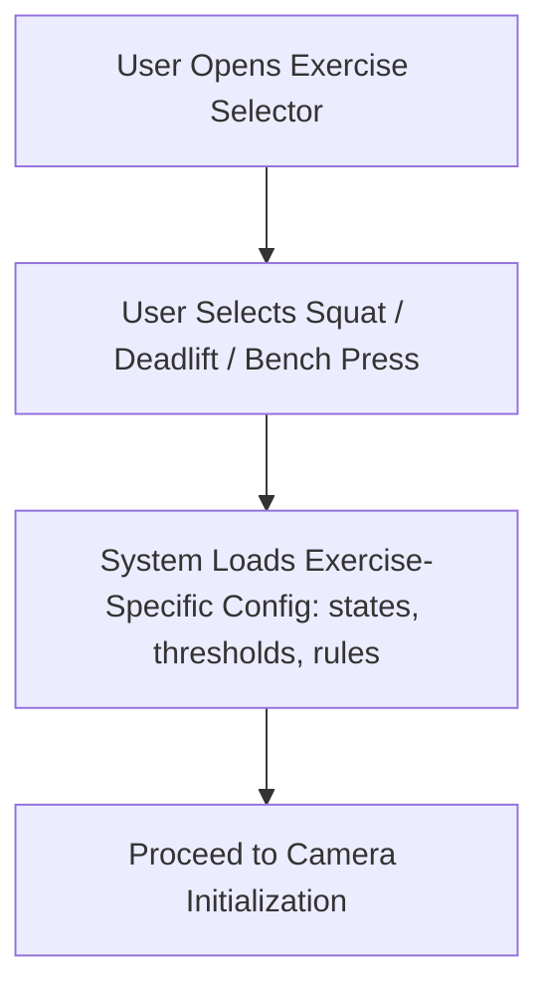

Automatic exercise recognition (inferring the exercise without user selection) is explicitly future scope, not V1.

## 6. Pose Detection Workflow

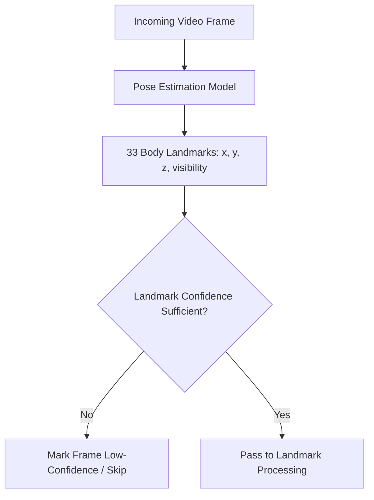

## 7. Landmark Processing Workflow

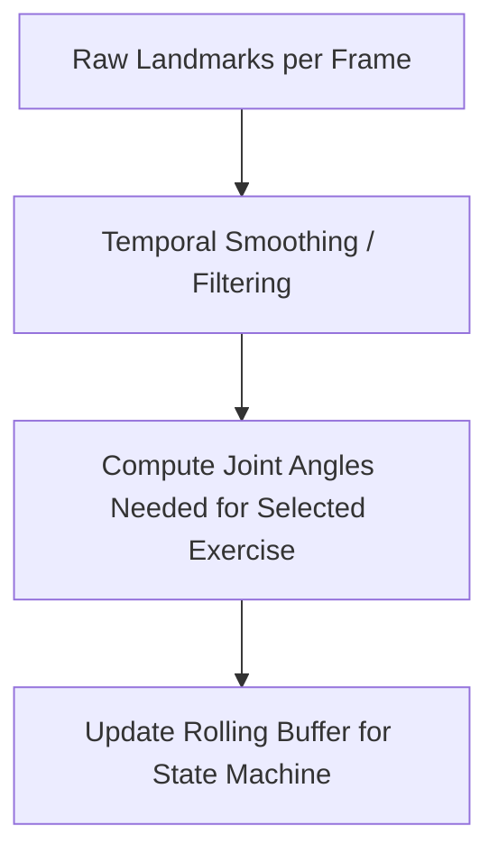

Smoothing exists because per-frame pose estimates jitter slightly even when the body is stationary; without filtering, this jitter can cross state thresholds and create false positives such as extra reps or spurious violations.

## 8. Exercise Verification Workflow

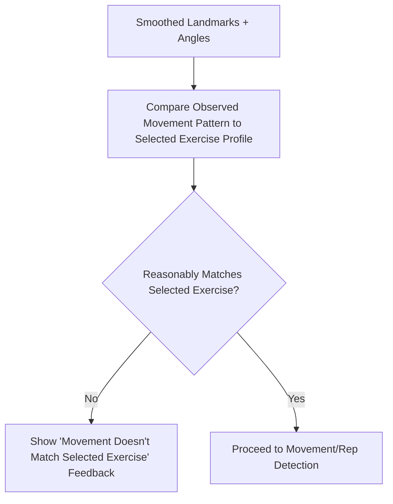

Verification is a coarse sanity check (e.g., is the hip/knee/torso motion pattern broadly squat-like), not a separate exercise classifier model.

## 9. Rep Detection Workflow

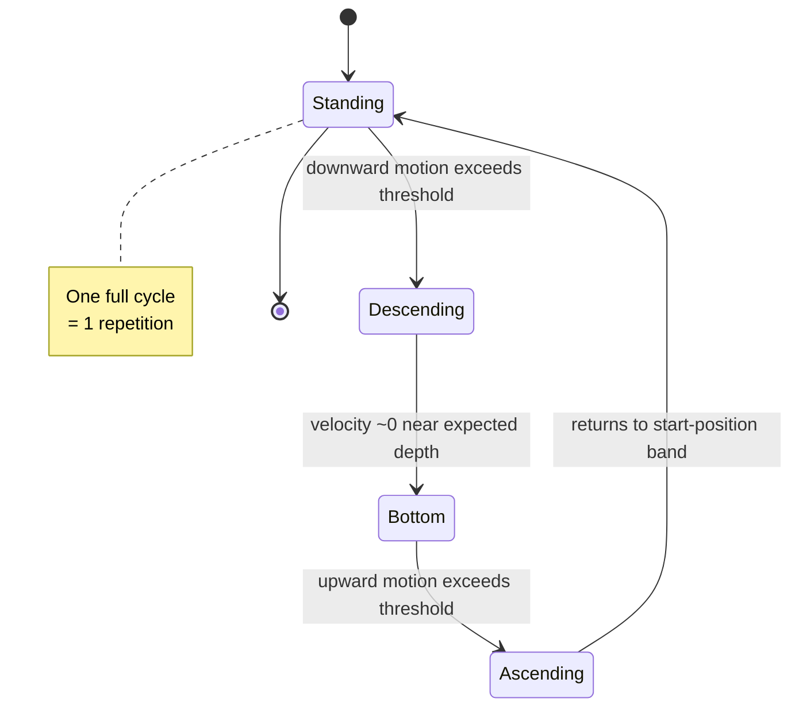

Each exercise defines its own states, angle/position thresholds, and hysteresis bands (a small "dead zone" between switching states) to avoid oscillation from noisy input. Thresholds are configuration values, not hard-coded constants, so they can be tuned per exercise or later personalized.

## 10. Squat Workflow

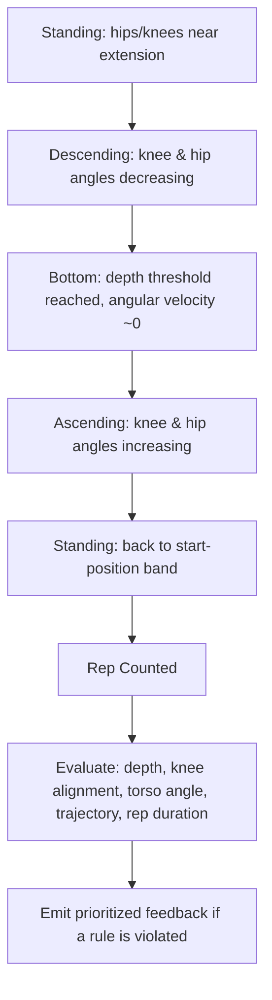

## 11. Deadlift Workflow

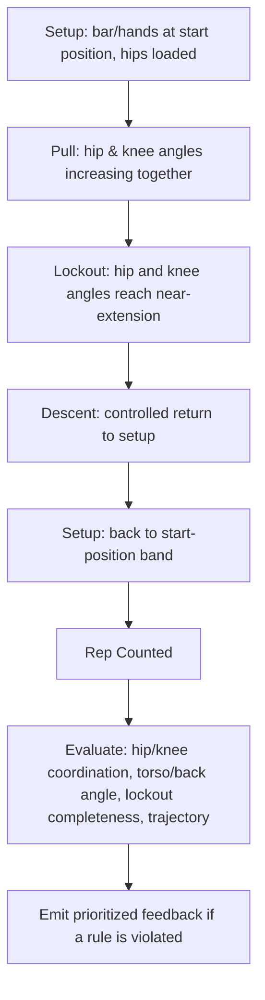

## 12. Bench Press Workflow

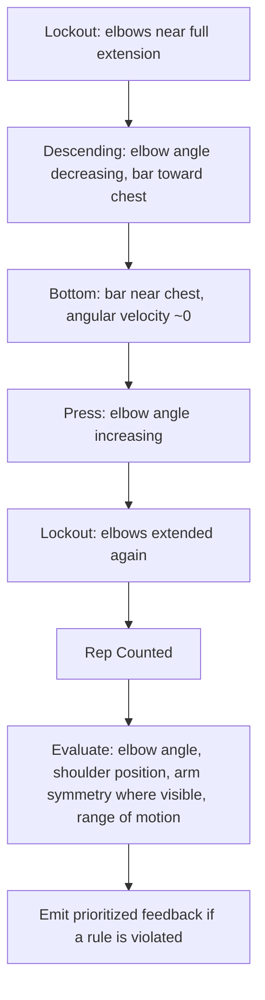

## 13. Form Analysis Workflow

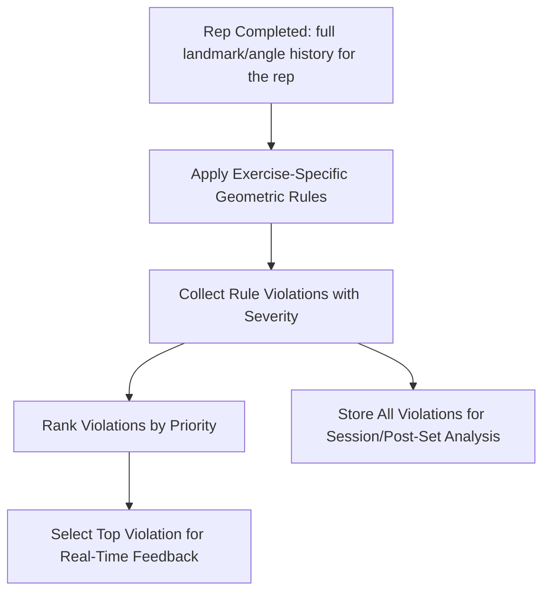

Form analysis is deliberately separated from rep detection and metric calculation: rep detection decides *whether* a rep happened, metric calculation computes *numbers* (angles, ROM, tempo), and form analysis interprets those numbers against rules to decide *what*, if anything, is wrong.

## 14. Real-Time Feedback Workflow

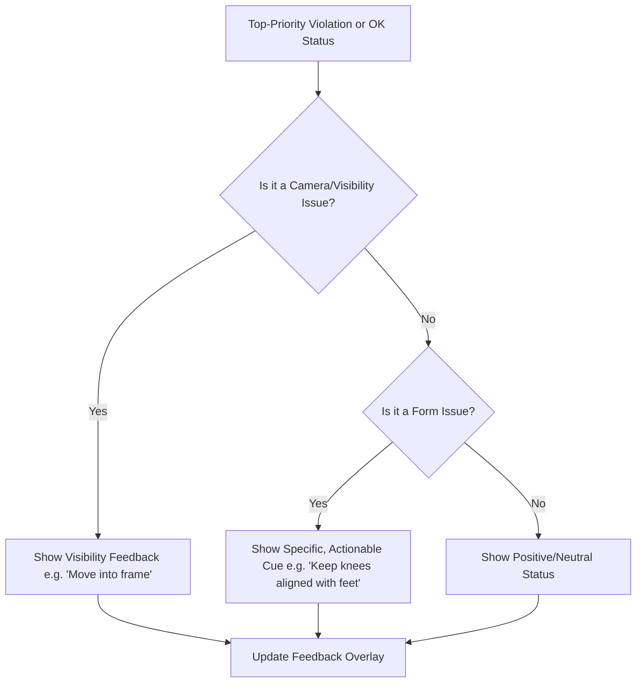

Only one message is shown at a time; the system suppresses lower-priority cues while a higher-priority one is active for the current rep.

## 15. Session Completion Workflow

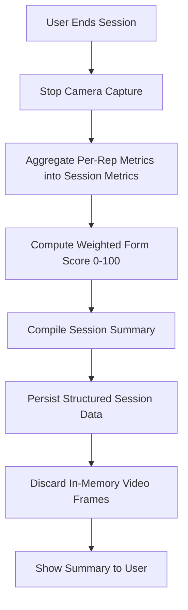

## 16. Data Storage Workflow

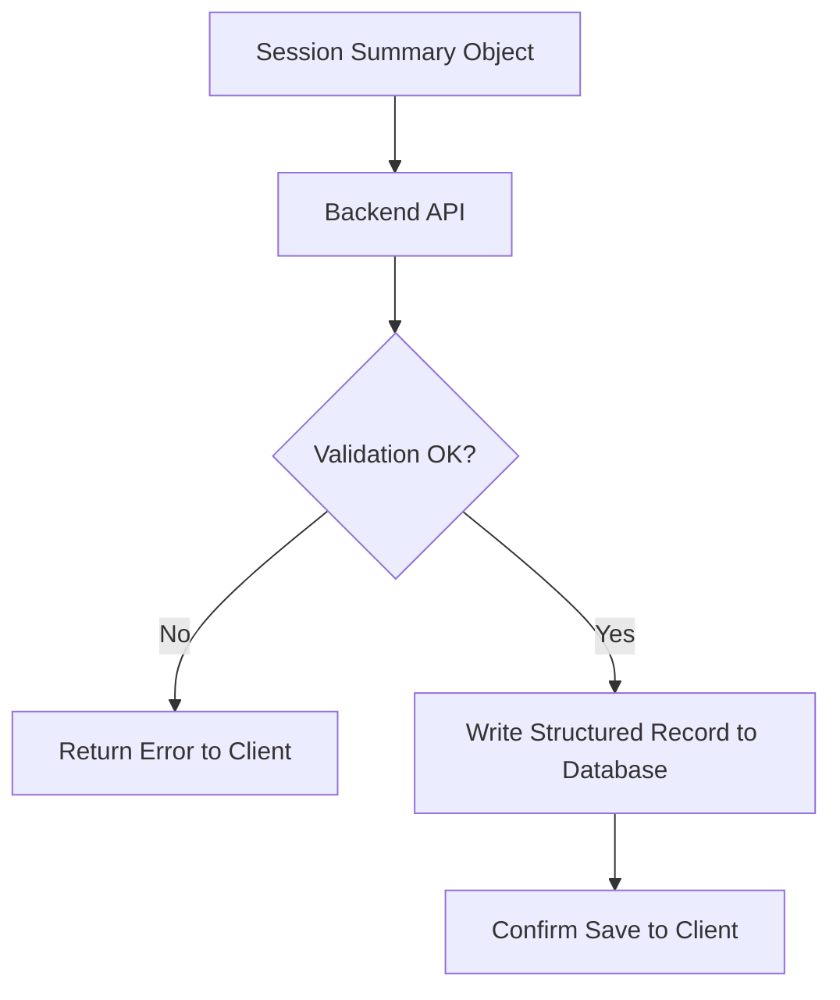

No frame or video data is included in the object sent to the backend; only structured fields (Section 16 of `PRD.md`) are transmitted and stored.

## 17. Dashboard Workflow

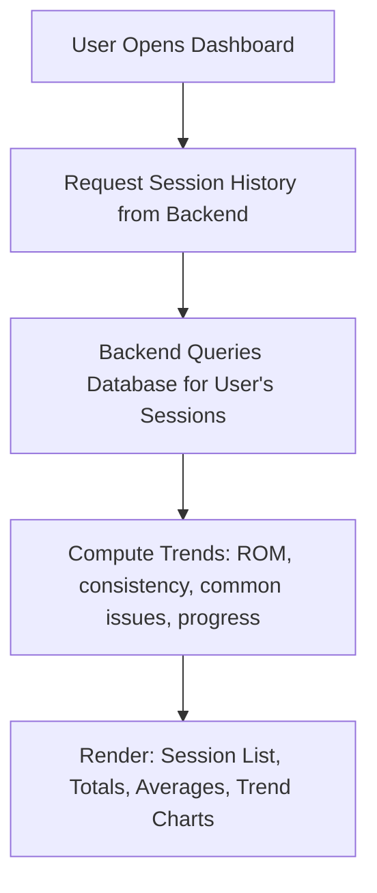

## 18. Error Handling Workflow

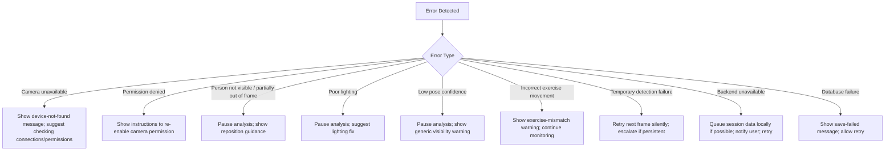

## 19. Edge Cases

* User steps fully out of frame mid-rep: the in-progress rep is not counted; the system returns to a neutral state once the user re-enters frame and visibility is restored.
* User performs an exercise different from the one selected: exercise verification flags the mismatch; reps are not counted against the wrong exercise's rules.
* Extremely fast or extremely slow reps: handled via configurable tempo bounds; unusually fast reps may be flagged for low confidence rather than silently counted.
* Multiple people in frame: V1 assumes a single primary user; secondary people in frame are not tracked (documented limitation).
* Session ended abruptly (e.g., browser closed) before summary is saved: partial data, if any was buffered, may be lost — handled as a known limitation, with future scope covering more robust session recovery.

## 20. Example End-to-End Session

1. User opens the app, logs in, selects **Squat**.
2. Camera permission is granted; positioning check confirms full-body visibility from a side angle.
3. User starts the set. Frame-by-frame: pose estimation → smoothing → angle calculation → exercise verification (confirms squat-like motion) → state machine tracks Standing → Descending → Bottom → Ascending → Standing.
4. Rep 1 completes; form analysis finds knees drifting inward past threshold; feedback shows "Keep your knees aligned with your feet."
5. Reps 2–5 complete with no rule violations above threshold; feedback shows a neutral/positive status.
6. User ends the session after 5 reps.
7. System aggregates metrics: average depth, tempo, one flagged knee-alignment issue on 1 of 5 reps, computed form score (e.g., 84/100).
8. Structured session record (no video) is saved via the backend API.
9. Summary screen shows the score, rep count, and the flagged issue.
10. Dashboard updates: this session is added to the user's Squat history, and the "knee alignment" issue is logged as a recurring/one-off pattern depending on history.
